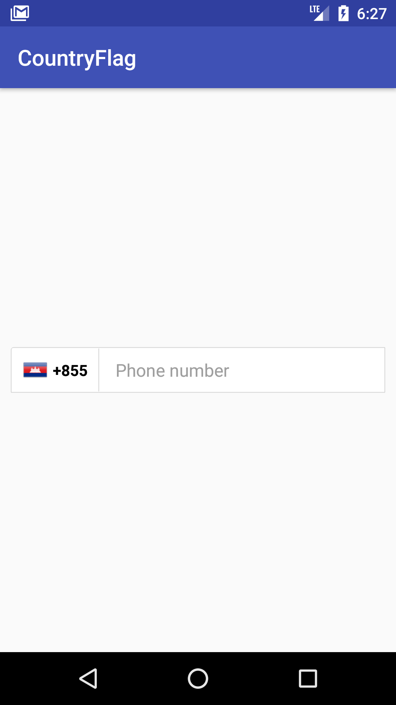
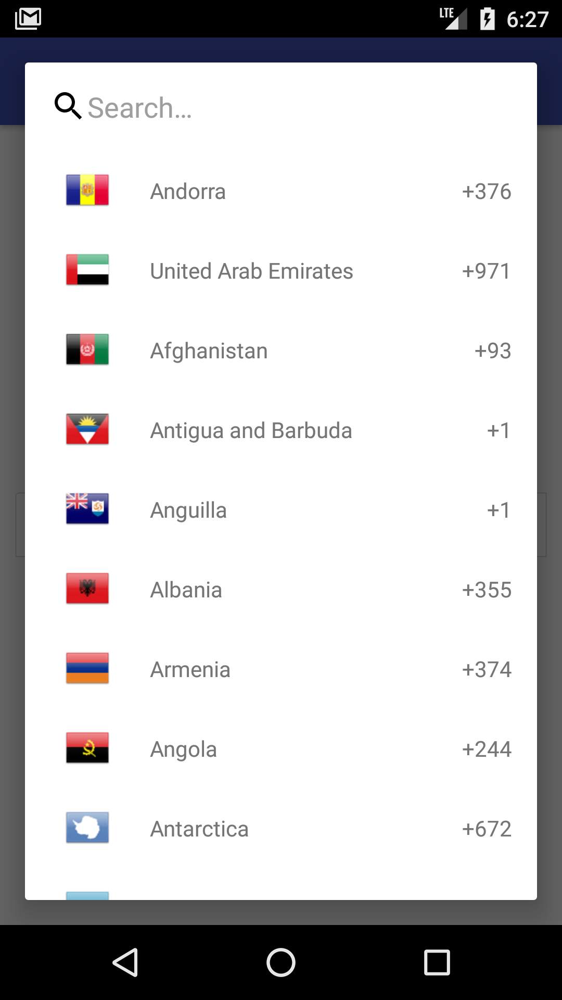
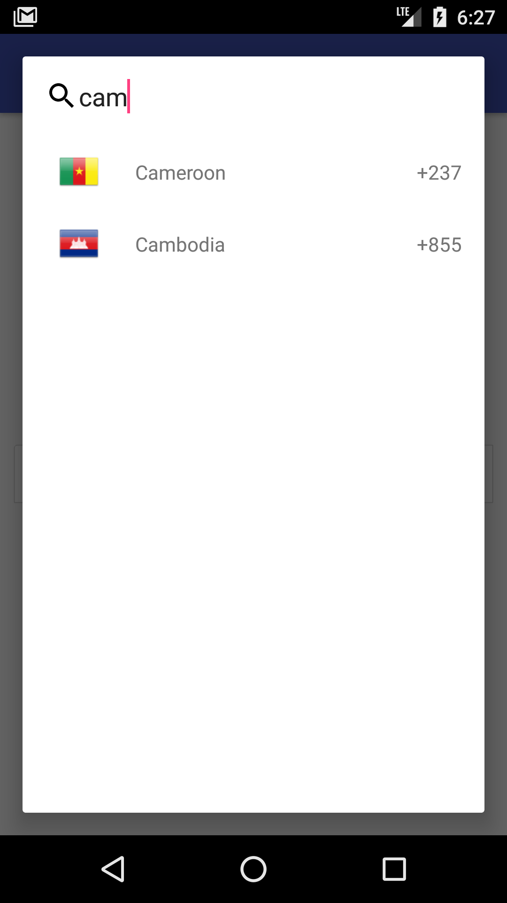

# Country with flag
This sample app with showing the way how to implement country list dailog

#  Simple Demo
<p align="left">
  
  
  
</p>
## Getting Started
This sample app with showing the way how to implement with country list dailog

## Installing

We can install this library by using gradle

Step 1

```
allprojects {
    repositories {
	maven { url 'https://jitpack.io' }
     }
}
```

Step 2

```
dependencies {
   implementation 'com.github.SunryTeang:country:1.0'
}
```

## Sample Using

```

class MainActivity : AppCompatActivity(), OnCountryPickerListener {

    private var countryPicker: CountryPicker? = null

    override fun onCreate(savedInstanceState: Bundle?) {
        super.onCreate(savedInstanceState)
        setContentView(R.layout.activity_main)

        countryPicker = CountryPicker.Builder().with(this)
                .listener(this)
                .build()
        select_country_pick.setOnClickListener {
            countryPicker?.showDialog(supportFragmentManager)
        }
        onSelectCountry(countryPicker?.getDefualtCountry(this))

    }


    override fun onSelectCountry(country: Country?) {
        flag_icon_imageview?.setBackgroundResource(country!!.flag)
        country_code_textview.text = "" + country?.dialCode
    }
}

```

## Min SDK Version

```
Support Min Sdk version >= 19

```

## Authors

* **Teang sunry** - [SunryTeang](https://github.com/SunryTeang)

See also the list of [contributors](https://github.com/SunryTeang/country/graphs/contributors) who participated in this project.

## License

This project is licensed under the MIT License - see the [LICENSE.md](https://github.com/SunryTeang/country/blob/master/README.md) file for details
